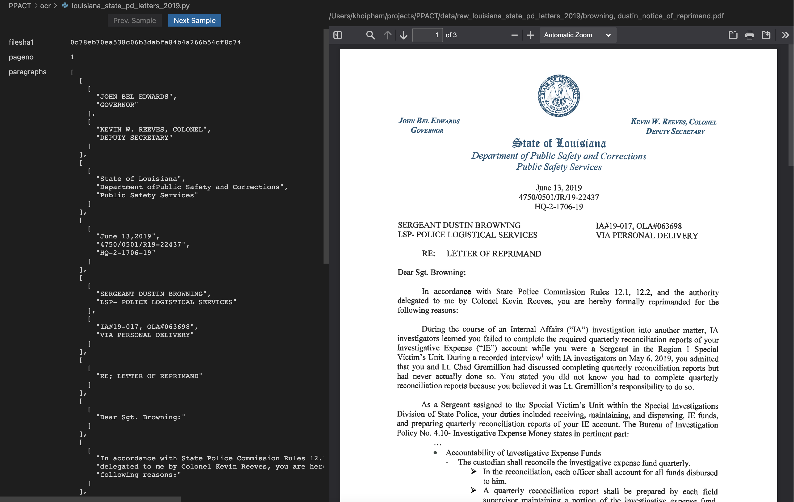

# spot-check README

This extension allows you to spot-check extracted data versus source PDFs. It is very useful when developing an OCR/document analysis pipeline using Python/Pandas. It does so by providing a custom editor that shows a record on the left half and a PDF on the right half.

## Features

- Take random samples from a Python script and show them on a custom editor:



## How to use

1. Install this extension
2. Install Python library `vscode-spot-check`:

   ```bash
   pip install vscode-spot-check
   ```

3. Add these lines to your Python script:

   ```python
   from vscode_spot_check import print_samples
   ...
   if __name__ == '__main__':
       dataframe = do_your_processing()
       print_samples(
           dataframe,
           resolve_source_path=lambda row: row.filepath,
           resolve_pageno=lambda row: row.pageno,
       )
       ...
   ```

4. Run the command `Open with Spot Check` while your Python script is opened.

## Requirements

- Python >= 3.8

## Extension Settings

This extension contributes the following settings:

- `spot-check.pythonInterpreterPath`: path to the Python interpreter this extension uses to run your Python script. Defaults to `python`.
- `spot-check.pythonPaths`: array of paths to add to `PYTHONPATH` during script execution. For any path, you can substitute the variable `workspaceFolder`.
- `spot-check.cwd`: current working directory during script execution. You can also substitute the variable `workspaceFolder` here.

## Python library reference

### `print_samples`

Print random samples from a dataframe. This function only works if the first shell argument to the script is "printSamples" (which is how the extension invokes this script), so you don't need to comment and then uncomment this function when running the script for a different purpose.

Arguments:

- **data** (pandas.DataFrame): the data to sample
- **resolve_source_path** (func(pandas.Series) -> str): given a row from the data, this function must return the absolute path to source PDF file
- **resolve_pageno** (pandas.Series) -> int): optional. Given a row from the data, this function must return the page number of the PDF.
- **number_of_samples** (int): number of samples to produce with each incantation. Defaults to 100.
- **sort** (bool): sort the samples according to the original row order. Defaults to True.
- **exit_on_success** (bool): exit the script after this function prints samples successfully. It prevents any code that comes after this function from running to reduce side effects. Defaults to True.

## Release Notes

### 0.0.2

Includes web assets in package

### 0.0.1

Initial release
